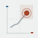
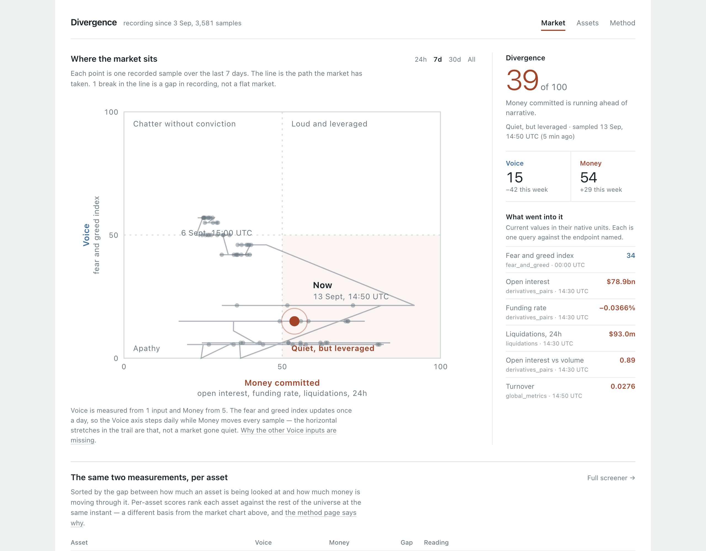
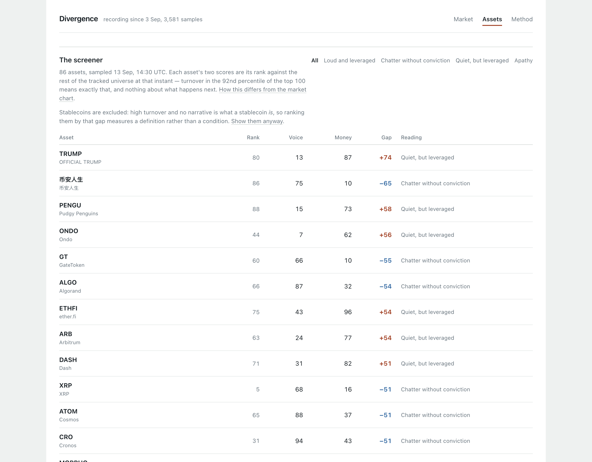
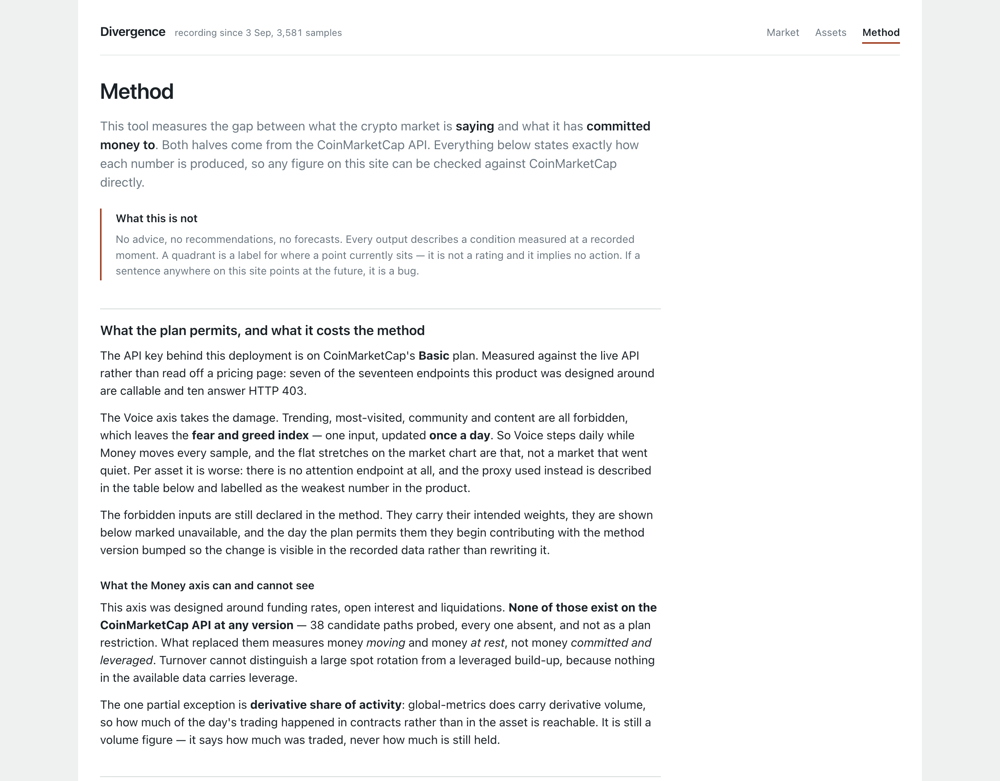
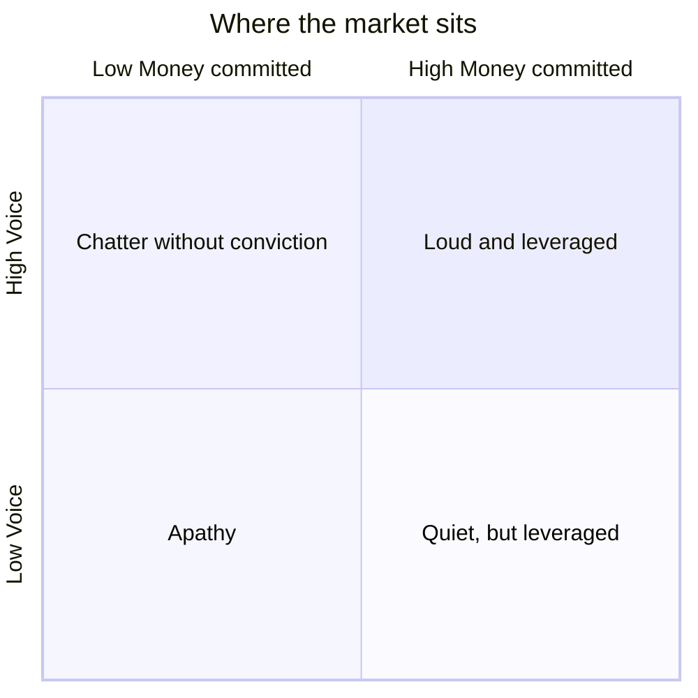
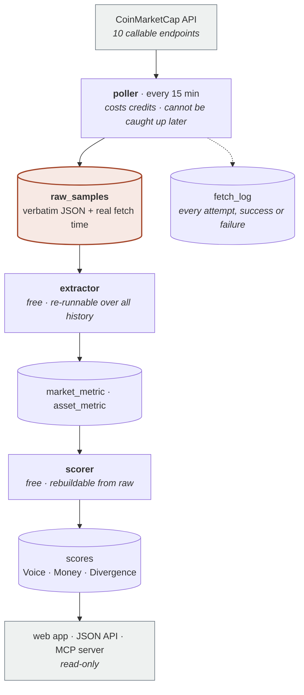

# Divergence

**What the crypto market is *saying*, plotted against what it has actually *committed money to*.**

CoinMarketCap publishes both halves of this — sentiment on one set of pages, derivative positioning
and flow on another — and never puts them on the same axis. That gap is the product.

Built for the CoinMarketCap API Hackathon.

### ▸ Live: **https://coinmarketcap.geralexgr.com**
### ▸ Judging this? **[JUDGE.md](JUDGE.md)** — five checks, a minute each

`JUDGE.md` shows how to verify any number on the site against CoinMarketCap directly, how to run the
tests with no API key, and — at the end — where we think this is weakest, in our own words.

<details>
<summary><b>Contents</b></summary>

- [The problem](#the-problem) — why this exists, and why nobody can build it retroactively
- [What is unusual about this entry](#what-is-unusual-about-this-entry)
- [The screen](#the-screen) — market view, screener, method page
- [What it measures](#what-it-measures) — the two scores and the four readings
- [What this is not](#read-this-first-what-this-is-not) — no advice, no predictions, and why
- [What the API plan costs the method](#read-this-second-what-the-api-plan-costs-the-method)
- [How it works](#how-it-works) — the pipeline, and why the recorder came first
- [Running it](#running-it) — setup, tests, the MCP server
- [CoinMarketCap endpoints used](#coinmarketcap-endpoints-used) — with a real request and response
- [Method](#method) — how a score is produced
- [Repo layout](#repo-layout) · [Constraints](#constraints)

</details>

---

## The problem

CoinMarketCap can tell you two things about the market, on two different pages.

**What people are feeling.** The fear and greed index, trending searches, community posts.

**What money is actually doing.** Volume, open interest, funding rates, liquidations.

It never puts them on the same axis — and the interesting question is not either one on its own. It
is *whether they agree*.

A market where everyone is greedy **and** leverage is piling in is a different market from one where
everyone is greedy and nobody has actually bought anything. Both show "Greed" on the index. Both
might show rising volume. They are not the same market, and nothing on CoinMarketCap distinguishes
them, because the two halves are never plotted against each other.

### Why nobody can just build this later

Price history can be fetched retroactively, forever. **Sentiment and positioning history cannot.**

There is no CoinMarketCap endpoint that answers "what was the fear and greed index, and what was
open interest, at 3pm last Tuesday". Those endpoints return *now*, and only now. So the gap between
the two can be measured today, but its history can only exist if something was writing it down at
the time.

That is why this project is a recorder first and a website second. The poller shipped before a
single line of frontend, and every hour it runs is an hour of history that nobody starting later can
reconstruct.

### What it does about it

1. **Records** both halves continuously — verbatim API responses, with the real fetch time.
2. **Normalises** them onto one 0–100 scale so they can be compared at all.
3. **Plots** them on a single chart, with the path the market took between readings.
4. **Repeats it per asset**, which turns the same idea into a screener.

### What a reading actually tells you

The live site at the time of writing:

> **Voice 66 · Money 39 · Divergence −27 — "Chatter without conviction"**

Read that as: the fear and greed index is well into greed, but open interest, funding and
liquidations are all subdued. People are *talking* like it is a bull market and *positioning* like
it is not. That is a fact about right now, checkable against CoinMarketCap in about a minute — and
it is not a number you can read off any single page there.

Flip it and you get the reading the tool was built to find: **low Voice, high Money** — nobody is
paying attention while leverage quietly builds.

### Who it is for

Anyone who already watches this market and wants one number for a question they currently answer by
eye across several tabs: *is the noise backed by money, or not?*

It is a **measuring instrument, not an advisor**. It will never tell you what to do about a reading
— see below for why that is a design constraint rather than caution.

---

## What is unusual about this entry

| | |
|---|---|
| **It records.** | CoinMarketCap has no historical endpoint for sentiment or positioning. Price history can be fetched retroactively; this cannot. Every point on the trail exists only because something was recording at the time, and it compounds daily. |
| **The method is data, not prose.** | `app/scoring/inputs.php` declares every input, weight and range. The scorer runs from it and the public method page renders from it, so the page *cannot* describe a method the code does not implement. |
| **It measures, never predicts.** | No signals, no entry levels, no buy/sell. A measurement can be checked against CoinMarketCap in thirty seconds; a prediction cannot be checked at all. There is a test that greps the generated copy for future-tense words. |
| **The mistakes are in the repo.** | 21 decisions with reasoning, including [D20](docs/decisions.md) — where we documented for two days that the derivatives endpoints did not exist, were wrong, and recorded how the error was possible. |
| **Missing inputs are dropped, not zeroed.** | Ten of the twenty endpoints in the catalogue are 403 on this key. Scores record how many inputs they actually used, and the app prints it. A zero would read as a quiet market; absence is a measurement of nothing. |

---

## The screen



Voice on the vertical axis, Money on the horizontal, each 0–100. The market sits at a point — and
because the recorder has been running, that point sits at the end of a **trail** showing the path it
took to get there. That trail is the part of this that cannot be reconstructed from an API call, by
anyone, at any later date.

Every input in the right-hand column carries the endpoint it came from and the minute it was
sampled, so any number here can be checked against CoinMarketCap directly.

*This one is from a local run against seeded history, because the live deployment started recording
on 13 September and its Voice axis has not stepped yet — the fear and greed index updates once a
day, so the live trail is currently a straight horizontal line. A picture of a straight line would
say less about the product than this does. The two shots below are live, and this one gets replaced
the moment the real trail has shape.*

### The screener



The same two measurements per asset, sorted by the gap between them. These axes exist nowhere on
CoinMarketCap's own site.

*Live, from the deployment.* Stablecoins are excluded by default and the page says so: high turnover
with no narrative is what a stablecoin *is*, so ranking them by that gap measures a definition rather
than a condition — they were four of the top nine rows until [D21](docs/decisions.md). One click
shows them again.

### The method page



*Live, from the deployment.* Rendered directly from `app/scoring/inputs.php` — the same declaration
the scorer runs from — so the page cannot describe a method the code does not implement. It states
what the API plan forbids *before* it states the method, and its recording-health figures come
straight from `fetch_log`.

---

## What it measures

Two scores, both normalised 0–100, both sampled continuously.

| Score | Question it answers | Inputs actually in use |
|---|---|---|
| **Voice** | How much is the market talking? | fear and greed index |
| **Money** | How much money is committed and at risk? | open interest, funding rate, liquidations, OI-to-volume, turnover |
| **Divergence** | How far apart are they? | `money − voice`, signed |

Four readings, from where the point sits:



| Reading | Voice | Money | What it describes |
|---|---|---|---|
| **Chatter without conviction** | ≥ 50 | &lt; 50 | People are talking; money has not followed |
| **Loud and leveraged** | ≥ 50 | ≥ 50 | Attention and positioning agree |
| **Apathy** | &lt; 50 | &lt; 50 | Neither the crowd nor the money is engaged |
| **Quiet, but leveraged** | &lt; 50 | ≥ 50 | Leverage building while nobody is watching |

A quadrant is a label for where a point sits. It is not a rating, and it implies no action.

The same two scores are computed **per asset**, which turns the tool into a screener with axes that
exist nowhere on CoinMarketCap's own site: sort the market by how much an asset is being looked at
against how much money is moving through it.

---

## Read this first: what this is not

This tool gives **no financial advice and no recommendations**. Not "consider reducing exposure",
not "this looks overheated", not a buy/sell/hold signal, not a risk rating that implies action.

Every output is a **measurement of a condition that exists right now, or existed at a recorded past
moment**. A quadrant is a label for where a point sits; it is not a rating. If a sentence points at
the future, it is a bug — there is a test that greps the readout copy for exactly that.

Two reasons this is a hard constraint rather than a disclaimer:

1. A measurement can be verified against CoinMarketCap in thirty seconds. A prediction cannot be
   verified at all.
2. Recommendations drag in liability and put the entry in the same bucket as most of the field.

---

## Read this second: what the API plan costs the method

The key behind this deployment reports **15,000 credits a month and 50 requests a minute**, and
`/v1/key/info` returns no tier name — so this repo does not assert one. What it asserts is what was
measured, call by call: **10 of the 20 endpoints in the catalogue are callable, and 10 answer HTTP
403.** Every one of those twenty was re-checked against the live API on 13 September and
the table below reflects what came back, not what the documentation promises.

The Voice axis takes the damage. Trending, most-visited, community and content are all forbidden,
leaving the fear and greed index — one input, updated **once a day**. So Voice steps daily while
Money moves every fifteen minutes.

This is stated on the market screen, on the method page, and here, because a tool that showed a flat
Voice line without explaining it would be misrepresenting the market rather than the plan. The
forbidden inputs stay declared in the method at their intended weights and light up automatically if
the plan changes — see [D16](docs/decisions.md).

**The Money axis measures real leverage.** Open interest, funding rate and liquidations, from the
`/v5/` derivatives family — $76.6bn of BTC open interest, funding weighted by open interest across
every venue, and 24h liquidations split long from short.

Getting there involved being wrong in public first. This repo spent two days documenting, after
probing 38 paths, that the CoinMarketCap API has **no** derivatives endpoints — because the probe
swept `/v1/` to `/v4/` and the family lives under `/v5/`. [D20](docs/decisions.md) records the
correction, how it was found, and what changed so the same class of miss cannot recur. The
superseded inputs are still declared at weight zero, so a score from before the fix and one from
after can be compared rather than silently swapped.

---

## How it works



**`raw_samples` is the only irreplaceable box.** Everything downstream of it is a cache of an
interpretation and can be rebuilt at any time — that is why the arrows only ever flow one way out of
it.

Three separable jobs, on their own cron entries and offset minutes:

| Job | Costs credits | Can be caught up later | Why separate |
|---|---|---|---|
| **fetch** | yes | **no** | the only irreversible step; nothing may delay it |
| **extract** | no | yes | bump `EXTRACTOR_VERSION`, re-read every payload ever stored |
| **score** | no | yes | change a weight, `--rebuild`, whole history rescored |

Detail: [`docs/architecture.md`](docs/architecture.md) · Tables: [`docs/data-model.md`](docs/data-model.md)

### Why the recorder is the whole product

CoinMarketCap's API is almost entirely **snapshot data**. Price history can be fetched
retroactively; **positioning and sentiment history cannot**. There is no historical endpoint for
turnover, exchange flow or social volume at usable granularity, and none at all for some of it.

So the trail on the plot, every "up 26 this week" figure, and every quadrant transition exist only
because something was recording at the time. Whoever starts recording on day one owns a dataset
nobody starting later can reconstruct.

### Why raw payloads are stored verbatim

Every sample writes the response body alongside the parsed fields. The parsing was wrong once
already and the weights are provisional — both can be corrected without losing a single sample,
because `bin/extract.php --rebuild` and `bin/score.php --rebuild` re-derive everything from payloads
already on disk. The formula guessed at on day one is not locked in.

---

## Running it

### Requirements

PHP 8.0+ CLI with `curl`, `json` and `pdo_mysql`. MySQL 5.6+. No composer, no framework, no
node, no build step. The only third-party dependency in the project is CoinMarketCap itself — the
quadrant chart is hand-drawn SVG rather than a charting library.

### Setup

```bash
# 1. Does the API surface look the way this repo says it does? No key, no credits.
php app/bin/probe-paths.php

# 2. Point the config at your key and database. Outside the webroot.
cp config.example.php ../config.php && chmod 600 ../config.php

# 3. Can this host actually do the job? Run it ON the host, over SSH.
php app/bin/preflight.php

# 4. Which endpoints does the plan permit? ~6 credits.
php app/bin/verify-endpoints.php --save-fixtures

# 5. Create the tables. One script, safe to re-run.
mysql -u USER -p DB < docs/schema.sql

# 6. One sample, verbose, nothing hidden.
php app/poller/run.php --once

# 7. Read stored payloads into typed rows. No credits, no network.
php app/bin/extract.php --verbose

# 8. Score them.
php app/bin/score.php --verbose

# 9. Is it still recording, and is it still being read?
php app/bin/health.php
```

Then point the document root at `public/` and open it.

**Deploying to cPanel: [DEPLOY.md](DEPLOY.md)** — step by step, written for the download-the-zip
workflow. The reasoning behind each step is in [`docs/deploy.md`](docs/deploy.md).

The tests need no key, no database and no network:

```bash
php tests/run.php
```

### The MCP server

Same scores, as agent tools, over the same queries the web app reads through:

```json
{ "command": "php", "args": ["/home/USER/divergence/app/mcp/server.php"] }
```

Seven tools, none of which takes a write action. Surface: [`docs/mcp-tools.md`](docs/mcp-tools.md).

---

## CoinMarketCap endpoints used

Two different questions, answered by two different scripts. **Does the path exist?** —
`app/bin/probe-paths.php`, no key needed. **May this plan call it?** — `app/bin/verify-endpoints.php`, needs
the key. Both were run; the results are in [`docs/endpoint-access.md`](docs/endpoint-access.md) and
encoded in `endpoint_access_results()` so the poller cannot schedule a forbidden endpoint by
accident.

| Axis | Endpoint | Used for | Access |
|---|---|---|---|
| Voice | `/v3/fear-and-greed/latest` | market-wide sentiment level | ✅ |
| **Money** | `/v5/cryptocurrency/derivatives/market-pairs/list/latest` | **open interest, funding rate, basis** | ✅ |
| **Money** | `/v5/derivatives/liquidations/cryptocurrency/list/latest` | **long and short liquidations, 100 assets per credit** | ✅ |
| **Money** | `/v5/exchange/derivatives/list` | per-venue derivative volume and open interest | ✅ |
| Money | `/v1/global-metrics/quotes/latest` | turnover, derivative share of activity | ✅ |
| Money | `/v1/exchange/assets` | exchange reserve level, and its movement | ✅ |
| Money | `/v2/cryptocurrency/quotes/latest` | per-asset turnover | ✅ |
| Both | `/v1/cryptocurrency/listings/latest` | the asset universe and its per-asset inputs | ✅ |
| Ops | `/v1/key/info` | credit budget, at no credit cost | ✅ |
| Voice | `/v1/community/trending/{topic,token}` | trending rank and its churn | 403 |
| Voice | `/v1/cryptocurrency/trending/{latest,most-visited,gainers-losers}` | attention before a trade | 403 |
| Voice | `/v1/content/{latest,posts/top}` | community post volume | 403 |
| Money | `/v1/exchange/listings/latest` | concentration of volume across venues | 403 |
| Money | `/v2/cryptocurrency/market-pairs/latest` | derivative pair volume | 403 |

### A real request and response

```bash
curl -s -H "X-CMC_PRO_API_KEY: $KEY" \
  "https://pro-api.coinmarketcap.com/v1/global-metrics/quotes/latest?convert=USD"
```

```json
{
  "data": {
    "quote": { "USD": {
      "total_market_cap": 2642374254402.301,
      "total_volume_24h": 41470272862.18,
      "total_volume_24h_reported": 213171617521.92,
      "stablecoin_volume_24h": 40784975505.60018,
      "derivatives_volume_24h": 307986299285.3649,
      "last_updated": "2026-09-13T04:37:59.999Z"
    } },
    "btc_dominance": 58.682385998691,
    "active_cryptocurrencies": 8172
  },
  "status": { "error_code": "0", "credit_count": 1, "elapsed": 12 }
}
```

Two of the Money inputs are derived from that single response:

```
market_turnover     = 41470272862.18 / 2642374254402.30  = 0.0157
derivatives_to_spot = 307986299285.36 / 41470272862.18   = 7.43
```

Derivative volume was **7.4× spot volume** at that moment. That ratio is the closest this API gets
to a leverage reading, and it is not on a chart anywhere on CoinMarketCap's site.

### The trap that made this worth checking twice

`pro-api.coinmarketcap.com` answers an **unknown path with HTTP 200**, carrying
`status.error_code: 500` and "The system is busy, please try again later!". Controls:
`/v3/totally-made-up/xyz` and `/v5/anything` both do it.

Reading the HTTP status alone recorded six non-existent derivatives endpoints as working. Every
response in this repo is classified by `cmc_outcome()` in [`lib/http.php`](app/lib/http.php), which
reads the body's error code as well as the status, and `app/bin/probe-paths.php` runs two control paths
on every invocation so a change in CMC's routing surfaces as a failed control rather than as
silently wrong results.

The same quirk is what makes the prober work at all: CMC resolves the path *before* it validates the
key, so an invalid key returns 401 on a real path and 404 on a fake one. The whole API surface can be
mapped with no key and no credits.

---

## Method

Published, not hidden. The method page in the app renders directly from `scoring/inputs.php` — the
same declaration the scorer runs from — so the page cannot describe a method the code does not
implement.

Three things it states that a black box would not:

- **Missing inputs are dropped, not zeroed**, and the surviving weights renormalise. Each score
  records how many of its declared inputs it actually saw. A zero would read as a measurement of a
  quiet market; absence is a measurement of nothing.
- **The normalisation switchover.** The first seven days use fixed reference ranges, because
  percentile rank against no history is meaningless. After that, percentile rank within a trailing
  window. The switchover date is on the page and the basis is stored on every row.
- **Per-asset scores use a third basis** — ranked against the rest of the universe at the same
  instant rather than against their own past ([D17](docs/decisions.md)). Different measurement,
  never plotted on the same chart.

Full spec: [`docs/method.md`](docs/method.md) · What it cannot see: [`docs/limits.md`](docs/limits.md)

---

## Repo layout

```
divergence/
├── DEPLOY.md              cPanel, step by step
├── config.example.php     shape of the real config, which lives outside the webroot
│
├── app/                   ← everything that must NOT be web-reachable
│   ├── poller/run.php       the recorder — the only writer of source data
│   ├── lib/                 config, http client, db writers, endpoint catalogue, queries
│   ├── scoring/             the method as data, normalisation, and the recompute pass
│   ├── mcp/server.php       MCP server over the same queries
│   └── bin/                 probe-paths · verify-endpoints · preflight · extract · score · health
│
├── public/                ← the document root, and the ONLY web-served directory
│
├── tests/                 72 tests, no framework, no network, no database
└── docs/                  schema.sql · method · data model · decisions · limits · API friction
```

The `app/` and `public/` split is the deployment boundary, not decoration: `app/` holds the API key
loader and the poller, and a browser must never reach it. `app/.htaccess` denies everything as a
second line of defence, and the web app refuses to start if it finds the config inside the document
root.

---

## Constraints

- **50 requests/minute**, measured. Per-asset polling is batched: 100 assets is one call.
- **15,000 credits/month**, reported by `/v1/key/info` rather than assumed. This is the binding
  constraint on the whole product. Credits are read from each response and logged, not estimated.
- **Per-endpoint cadence**, because one interval for everything wasted most of the budget: the
  once-a-day fear and greed index was being fetched every tick for an identical value while the
  leverage inputs genuinely move. Open interest, funding and liquidations every 15 minutes; the
  universe every 30; reserves every 2 hours; sentiment every 3. **404 credits a day**, 19% under
  budget — cheaper than the old schedule *and* carrying three more inputs.
- **The host enforces a 15-minute cron floor** and silently rewrites anything faster. Per-endpoint
  cadence absorbs it completely: the poller is a cheap tick that decides what is due, so every
  endpoint still gets the interval it declares. Under the previous design the same rewrite would
  have tripled the gap between leverage samples.
- Every cron run is short and stateless, and takes a lock so a slow run makes the next tick skip
  rather than pile up behind it. Shared hosts kill long-running processes.
- The API key lives **outside the webroot** and never enters git.

---

## Licence

MIT — see [LICENSE](LICENSE).
