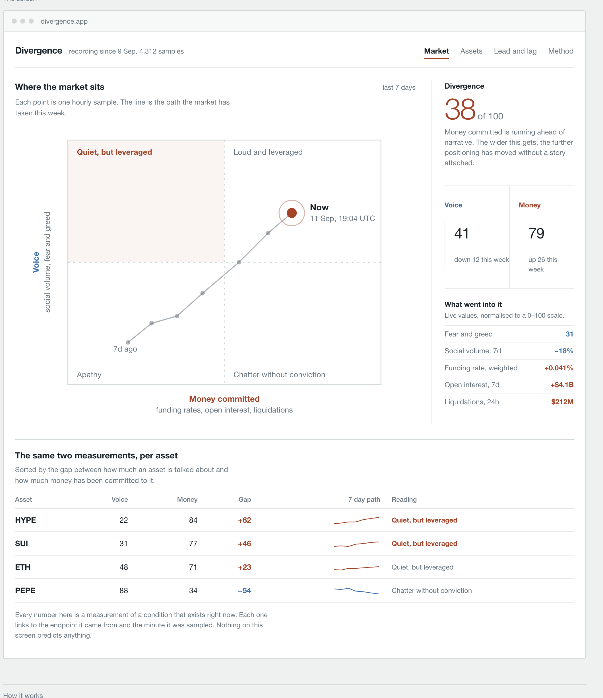
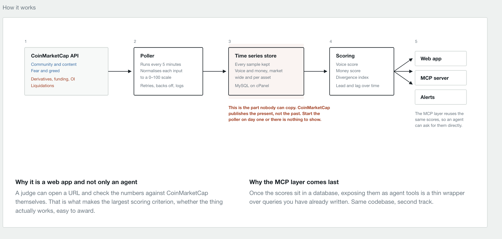

# Divergence

**What the crypto market is *saying*, plotted against what it has actually *committed money to*.**

CoinMarketCap publishes both halves of this — community and social activity on one set of pages,
volume and exchange flow on another — and never puts them on the same axis. That gap is the product.

Built for the CoinMarketCap API Hackathon (submissions close early October 2026).

> **Status: recording and extraction layers built and verified against the live API, not yet
> deployed.** The schema, the poller, the extractor, the endpoint verifier and the health check
> exist, are tested end-to-end against a real MySQL, and the extractor is tested against real
> CoinMarketCap payloads. Nothing is recording yet, because that needs the host.
>
> **The plan is Basic: 15,000 credits/month, and ten of the seventeen endpoints this design wanted
> answer 403** — including every social and trending endpoint the Voice axis was built on. See
> [D14](docs/decisions.md) and [docs/endpoint-access.md](docs/endpoint-access.md). Start at
> [TOMORROW.md](TOMORROW.md).

---

## The screen



*Mockup, not live data. Source: [`docs/mockups/dashboard-mockup.html`](docs/mockups/dashboard-mockup.html).*

---

## What it measures

Two scores, both normalised 0–100, both sampled continuously.

| Score | Question it answers | Inputs |
|---|---|---|
| **Voice** | How much is the market talking? | social / community volume, fear and greed, trending |
| **Money** | How much money is actually moving? | turnover (volume ÷ market cap), exchange concentration, reserve movement |
| **Divergence** | How far apart are they? | the signed gap between the two |

Plotted as a quadrant — Voice on one axis, Money on the other. The market sits at a point, and
because we record continuously, that point sits at the end of a **trail** showing the path it took
to get there.

| | Low Money | High Money |
|---|---|---|
| **High Voice** | Chatter without conviction | Loud and leveraged |
| **Low Voice** | Apathy | Quiet, but leveraged |

The same two scores are computed **per asset**, which turns the tool into a screener with axes that
exist nowhere else: sort the market by how much an asset is talked about versus how much money sits
behind it.

---

## Read this first: what this is not

This tool gives **no financial advice and no recommendations**. Ever. Not "consider reducing
exposure", not "this looks overheated", not a buy/sell/hold signal, not a risk rating that implies
action.

Every output is a **measurement of a condition that exists right now, or existed at a recorded past
moment**. If a sentence points at the future, it does not belong in this product.

Two reasons this is a hard constraint and not a disclaimer:

1. Judging weights "does it work" at 30%. A measurement can be verified by a judge against
   CoinMarketCap in thirty seconds. A prediction cannot be verified at all.
2. Recommendations drag in liability and put the entry in the same bucket as most of the field.

---

## Why the recorder is the whole product

CoinMarketCap's API is almost entirely **snapshot data**. Price history can be fetched
retroactively. **Positioning and sentiment history cannot** — there is no historical endpoint for
social volume, turnover or exchange flow at usable granularity, and none at all for some of it.

Which means:

- Whoever starts recording on day one owns a dataset nobody starting later can reconstruct.
- The trail on the plot, every "up 26 this week" figure, and the whole lead/lag analysis depend
  entirely on having recorded.
- **The poller ships before the frontend.** Not a later phase. A day of delay is a day of history
  that cannot be recovered.

If you are picking this up and the poller is not running: build the crudest version that works —
hit the endpoints, dump raw JSON with a timestamp into one table, deploy the cron. No schema
design, no scoring, no normalisation. Get it recording, then build everything else.

---

## Architecture



```
cPanel cron (every 5 min)
      │
      ▼
  poller.php  ──────►  CoinMarketCap API
      │                (voice endpoints + money endpoints)
      ▼
   MySQL
   ├── raw response JSON + timestamp    ← source of truth
   ├── extracted fields                 ← derived, recomputable
   └── fetch log                        ← every attempt, success or failure
      │
      ▼
  scoring layer  ──►  Voice / Money / Divergence, market-wide and per asset
      │
      ├──► web app (read-only)
      ├──► MCP server (thin wrapper over the same queries)
      └──► alerts
```

Detail: [`docs/architecture.md`](docs/architecture.md) · Tables: [`docs/data-model.md`](docs/data-model.md)

**Why a web app and not only an agent.** A judge can open a URL and check the numbers against
CoinMarketCap themselves. That is what makes the largest scoring criterion easy to award.

**Why the MCP layer comes last.** Once the scores sit in a database, exposing them as agent tools
is a thin wrapper over queries already written. Same codebase, second track.

---

## Stack

Deliberately boring and already paid for:

- **PHP** on cPanel shared hosting
- **MySQL**
- **Real cron** via cPanel, invoked through PHP CLI — not a `wget` to a URL, which inherits HTTP
  timeouts and creates a public endpoint that then has to be protected
- Vanilla JS + one charting library on the frontend
- No framework unless it earns its place

Not Vercel: the Hobby plan rejects any cron schedule resolving to more than once per day, and it
fails at deploy time. A daily sample makes the product pointless.

---

## Repo layout

```
divergence/
├── README.md              you are here
├── CLAUDE.md              brief for agents working in this repo
├── TOMORROW.md            the ordered task list — start here
├── ROADMAP.md             phases from today to submission
├── config.example.php     shape of the real config, which lives outside the webroot
├── poller/                cron entry point, one fetcher per endpoint
├── scoring/              normalisation + Voice / Money / Divergence
├── lib/                   db, http client, credit accounting
├── public/                the web app — the only web-served directory
├── mcp/                   MCP server exposing the same scores as agent tools
├── sql/                   migrations
├── bin/                   operational scripts
│   ├── probe-paths.php      which paths exist — no key needed
│   ├── verify-endpoints.php which ones our plan may call — needs the key
│   ├── preflight.php        can this host run the poller at all
│   └── health.php           is it still recording, and what did it cost
├── tests/                 scoring fixtures, mostly
└── docs/
    ├── architecture.md    components, cadence, failure behaviour
    ├── data-model.md      tables and why each column exists
    ├── method.md          exactly how each input is normalised and weighted
    ├── endpoint-access.md which CMC endpoints actually respond on our tier
    ├── open-questions.md  blockers to verify before building against them
    ├── decisions.md       decision log, with the reasoning
    ├── api-friction.md    where the API got in the way (submission requires this)
    ├── ui-spec.md         the four screens and what each one shows
    ├── mcp-tools.md       planned agent tool surface
    ├── deploy.md          cPanel runbook
    └── mockups/           the HTML mockup and rendered images
```

---

## How to run

Recording and extraction run today. Scoring and the web app do not exist yet.

```bash
# 1. Does the API surface look the way this repo says it does? No key needed, no credits.
php bin/probe-paths.php

# 2. Point the config at your key and database. Outside the webroot.
cp config.example.php ../config.php && chmod 600 ../config.php

# 3. Can this host actually do the job? Run it ON the host, over SSH.
php bin/preflight.php

# 4. Which endpoints does the plan let us call? ~20 credits.
php bin/verify-endpoints.php --save-fixtures

# 5. Create the tables. 001 is the recording core; 002 is everything derived from it.
mysql -u USER -p DB < sql/001_init.sql
mysql -u USER -p DB < sql/002_derived.sql

# 6. One sample, verbose, nothing hidden.
php poller/run.php --once

# 7. Read what was stored into the typed tables. No credits, no network.
php bin/extract.php --verbose

# 8. Is it still recording, and is it still being read?
php bin/health.php
```

The tests need none of the above — no key, no database, no network:

```bash
php tests/run.php
```

`--dry-run` fetches and reports without writing, for when you want to see the shape of a response
before committing to storing it.

Then the cron entries, which are the point of all of the above:

```
*/10 * * * * /usr/local/bin/php /home/USER/divergence/poller/run.php --market >> /home/USER/logs/divergence.log 2>&1
*/30 * * * * /usr/local/bin/php /home/USER/divergence/poller/run.php --assets >> /home/USER/logs/divergence.log 2>&1
7,27,47 * * * * /usr/local/bin/php /home/USER/divergence/bin/extract.php --quiet --limit=2000 >> /home/USER/logs/divergence.log 2>&1
```

The poller takes a per-scope lock, so a slow run makes the next tick skip rather than pile up
behind it. The extractor is a separate entry because it costs no credits and touches no network:
a slow extraction must never be able to delay a fetch, which is the half that cannot be caught up
on later. Full setup, including the parts specific to this host:
[`docs/deploy.md`](docs/deploy.md).

---

## CoinMarketCap endpoints used

Two different questions, and the repo answers them with two different scripts.

**Does the path exist?** — `php bin/probe-paths.php`, no key needed. Answered 12 September 2026.
**May our plan call it?** — `php bin/verify-endpoints.php`, needs the key, run from the host. Open.

| Axis | Endpoint | Used for | Exists | Plan access |
|---|---|---|---|---|
| Voice | `/v3/fear-and-greed/latest` | market-wide sentiment level | ✅ | ❓ |
| Voice | `/v1/community/trending/{topic,token}` | trending rank and its churn | ✅ | ❓ |
| Voice | `/v1/cryptocurrency/trending/most-visited` | page views — attention before a trade | ✅ | ❓ |
| Voice | `/v1/content/latest` | community post volume | ✅ | ❓ |
| Money | `/v2/cryptocurrency/quotes/latest` | turnover = volume ÷ market cap | ✅ | ❓ |
| Money | `/v1/exchange/listings/latest` | concentration of volume across venues | ✅ | ❓ |
| Money | `/v1/exchange/assets` | exchange reserve movement | ✅ | ❓ |
| Both | `/v1/cryptocurrency/listings/latest` | the asset universe | ✅ | ❓ |
| Ops | `/v1/key/info` | credit budget, at no credit cost | ✅ | ❓ |

### There are no derivatives endpoints

The Money axis was designed around funding rates, open interest and liquidations. **None of them
exist on the CoinMarketCap API.** 38 candidate paths probed across `/v1/` to `/v4/` — derivatives
listings, quotes, exchanges, funding rate, open interest, liquidations, futures, perpetuals — every
one absent. Not 403. Absent, so no plan upgrade produces them.

The Money axis is rebuilt from turnover, exchange concentration and reserve movement. That is a
weaker axis: it measures money *moving*, not money *committed and leveraged*, and nothing in the
available data carries leverage. The method page says exactly that. Decision **D10** in
[`docs/decisions.md`](docs/decisions.md); evidence in
[`docs/endpoint-access.md`](docs/endpoint-access.md).

### The trap that made this worth checking twice

`pro-api.coinmarketcap.com` answers an **unknown path with HTTP 200**, carrying
`status.error_code: 500` and "The system is busy, please try again later!". Controls:
`/v3/totally-made-up/xyz` and `/v5/anything` both do it.

Reading the HTTP status alone recorded six non-existent derivatives endpoints as working. Every
response in this repo is classified by `cmc_outcome()` in [`lib/http.php`](lib/http.php), which
reads the body's error code as well as the status, and `bin/probe-paths.php` runs two control paths
on every invocation so a change in CMC's routing surfaces as a failed control rather than as
silently wrong results.

The same quirk is what makes the prober work at all: CMC resolves the path *before* it validates
the key, so an invalid key returns 401 on a real path and 404 on a fake one. The API surface can be
mapped with no key and no credits.

---

## Method

The scoring is published, not hidden — a page in the app states exactly how each input is
normalised and weighted, and when the normalisation basis changed.

The one honest wrinkle, documented rather than buried: percentile-rank normalisation is meaningless
for the first several days because there is no distribution to rank against. So the first seven days
use **fixed reference ranges**, then the switch to percentile ranking happens once enough history is
banked. The switchover date and the reason go on the method page.

Full spec: [`docs/method.md`](docs/method.md).

---

## Constraints worth remembering

- **30 requests/minute.** Per-asset polling needs batching. Cap the universe at the top ~100.
- **15,000 call credits/month** — the Basic plan, measured rather than assumed (D14). This is the
  binding constraint on the entire product and it sets the cadence (D15). Log credits per call from the response so usage is
  observable rather than guessed.
- **Cadence:** 5 minutes market-wide, 15 minutes per asset. Roughly 6k market rows and 600k asset
  rows over three weeks — about 100 MB with indexes.
- Keep each cron run short and stateless. Shared hosts kill long-running processes.
- API key lives **outside the webroot**, never in git. A leaked key is a direct hit on the code
  quality score.

---

## Judging criteria, for prioritisation

| Weight | Criterion | What it means here |
|---|---|---|
| 30% | Does it work | A judge opens the URL and checks numbers against CMC |
| 25% | Usefulness | Answers a question CMC's own site cannot |
| 20% | Interesting API use | Unusual endpoint mix, derived metrics rather than re-display |
| 15% | Code quality and docs | Clean repo, method page, no leaked key |
| 10% | Presentation | The quadrant trail is the demo moment |

When trading off, protect "does it work" first. A smaller product that demonstrably runs beats a
larger one with a broken panel.

---

## Licence

MIT — see [LICENSE](LICENSE).
